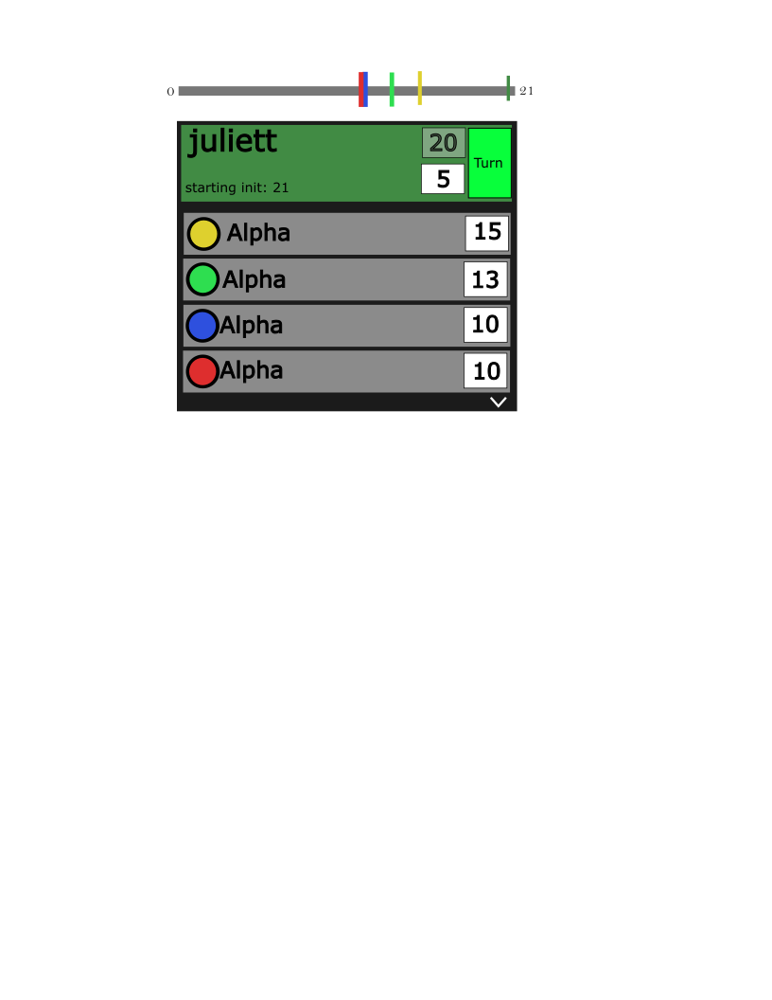

Initialized 23MAR2026


**Notes:**
- The current Foundry adapter is a prototype. File locations and `module.json` may change as the project matures.
- This project is not yet published on the Foundry package manager; manual installation is required.

# Big Picture

This is a module for Foundry VTT which implements the Reflex system ruleset as presented in the book. This project is now called Reflex-fvtt.

This project started as an attempt to implement the Reflex systems initiative system. Twilight 2013 uses a scheduled-turn initiative system, where every actor's actions are placed on a track, and turns are resolved as a queue. The project was previously called reflex-init-track.

Once complete with the canonical ruleset, this module will come packaged with updates and fixes to improve gameplay.

## UI prototype




# Todo

- [ ] Full Reflex Engine dev for Foundry VTT
- [ ] Scale measurements to fit large scale UI
- [ ] AB13 extensions
- [ ] Random terrain?
- [ ] Detail subsystem
- [ ] draw.io implementation?
- [ ] svg/inkscape support?
 - 
# Heads up

[settings.json](.vscode/settings.json) has hidden a bunch of basement level config files. If you're having issues, consider revealing these to check the basement.

# Installation

## Quick Start

1. **Clone or download** this repository.
2. **Install dependencies:**
   ```sh
   npm install
   ```
3. **Build and package everything:**
   ```sh
   npm run make
   ```
   This will:
   - Build all TypeScript packages (including the UI sandbox and Foundry module code)
   - Run the Foundry packaging script to assemble a ready-to-install module in `build/reflex-module/`

---

## Local UI Sandbox

To run the standalone UI for rapid prototyping:

```sh
npm run dev
```
This launches the Vite dev server. Open the browser at the provided local address to use the initiative tracker and test mechanics.

---

## Monorepo Import Guidance

When importing from the reflex-shared package in other packages, **always import from the built output (the package root, e.g. `reflex-shared/index.js`) and never from `src/` files**. This ensures TypeScript and Node can resolve modules correctly across package boundaries.

Example:

```ts
// Good:
import { advanceTurn, getNextActors } from 'reflex-shared';
import type { CharacterRecord } from 'reflex-shared';

// Bad:
import { advanceTurn } from 'reflex-shared/src/advanceTurn';
import type { CharacterRecord } from 'reflex-shared/src/types';
```

## Foundry VTT Module (Manual Install)

After running `npm run make`, the packaged Foundry module will be in `build/reflex-module/`.

1. **Copy the folder** `build/reflex-module/` to your Foundry `Data/modules/` directory.
   - By default, this is at `%localappdata%/FoundryVTT/Data/modules/` on Windows.
2. In Foundry, go to **Configuration > Manage Modules** and enable the Reflex Scheduler module.
3. Open a combat encounter. The Reflex Scheduler panel should be available from the UI or via the module's controls.

# Book Mechanics

## Exchanges of fire
At the beginning of an exchange of fire, every participant in the combat receives a base initiative value determined by his current encumbrance  (see  p.  206  for  rules  on  determining  a  character’s encumbrance level): 

Then make an OODA check (the initiative check).  If the check fails, the character’s base initiative doesn’t change.  If it succeeds, add twice the margin of success to his base initiative value.  The result  is  the  character’s  starting  initiative  value  –  the  tick  on which he begins his first action.

Once initiative is determined, the exchange of fire starts on the  tick  equal  to  the  highest  initiative  of  any  participant.    As  all characters  execute  actions,  the  current  tick  counts  down  toward zero.  The exchange of fire ends after the end of Tick 1.

## Performing Tactical Actions
Every tactical action has a tick cost.  This is the number of ticks required for a character to perform it.  A character may perform a tactical action on the tick equal to his current initiative.  When this occurs, subtract the action’s tick cost from the character’s current initiative value.  A character may not take an action whose tick cost would reduce his initiative below zero, except for the Wait action.

Multiple  characters  will  often  have  the  opportunity  to  act on the same tick.  For the purposes of timing and preemption, all actions that occur on the same tick are assumed to occur and take effect simultaneously.  This means that if two characters fire at each other on the same tick and both attacks succeed, both characters are hit at the same instant.

## Ending an Exchange of Fire
At  the  end  of  an  exchange  of  fire,  all  participants  in  the combat have the  option to press  or hold.  If all involved parties choose to hold, a pause begins.  If any participant chooses to press, a new exchange of fire begins immediately.  Every combatant who presses at the end of an exchange of fire increases his base initiative value in the next exchange of fire by 5.

Remember that a character who is broken (see p. 159) must hold.  His self-preservation drive prevents him from pressing for continued hostilities.

# Future requirements

- initialize with API calls to dice.exe?
- implementation in a VTT
- 'multiplayer' integration
- Player sheet connections


# Codebase

## Dependencies

### Root dependencies (package.json)

- **react**: ^18.0.0
- **react-dom**: ^18.0.0
- **zod**: ^3.0.0

### Dev dependencies

- **@league-of-foundry-developers/foundry-vtt-types**: ^13.346.0-beta.20250812191140
- **@testing-library/jest-dom**: ^6.9.1
- **@testing-library/react**: ^16.3.2
- **@types/node**: ^25.5.0
- **@types/react**: ^19.2.14
- **@types/react-dom**: ^19.2.3
- **@types/testing-library__react**: ^10.2.0
- **eslint**: ^8.0.0
- **eslint-config-prettier**: ^9.0.0
- **eslint-plugin-react**: ^7.0.0
- **fvtt-types**: npm:@league-of-foundry-developers/foundry-vtt-types@^13.346.0-beta.20250812191140
- **prettier**: ^3.0.0
- **typescript**: ^5.4.0


---

## Types

See [types](types.md)
